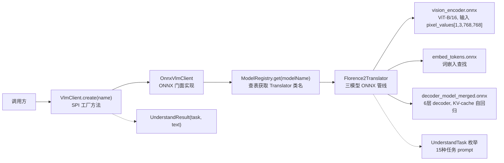
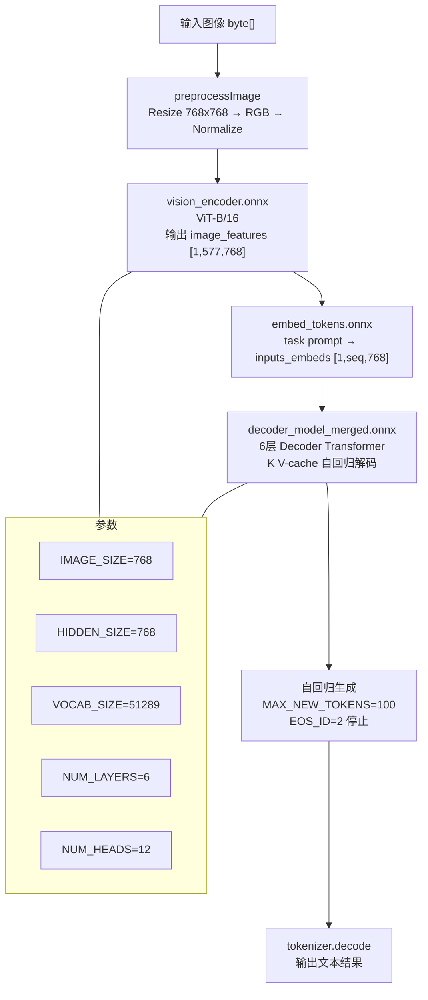

# Florence-2 VLM ONNX 端到端测试报告

> 模块：`utils-support-deeplearning-onnx-starter` · `com.chua.deeplearning.support.onnx.florence2`
> 测试日期：2026-09-01
> 模型来源：[onnx-community/Florence-2-base-ft](https://huggingface.co/onnx-community/Florence-2-base-ft)（MIT 许可证）
> 运行环境：Java 25 / ONNX Runtime 1.29.0 / Windows amd64 / CPU

---

## 一、能力总览

| 能力 | 接口 | 默认模型 | 引擎 |
| --- | --- | --- | --- |
| 图像描述 | `VlmClient.create(name).understand(img, CAPTION)` | `florence2` | ONNX |
| OCR 文字提取 | `VlmClient.create(name).understand(img, OCR)` | `florence2` | ONNX |
| 详细图像描述 | `VlmClient.create(name).understand(img, DETAILED_CAPTION)` | `florence2` | ONNX |
| 物体检测 | `VlmClient.create(name).understand(img, OD)` | `florence2` | ONNX |
| OCR + 区域 | `VlmClient.create(name).understand(img, OCR_WITH_REGION)` | `florence2` | ONNX |
| 密集区域描述 | `VlmClient.create(name).understand(img, DENSE_REGION_CAPTION)` | `florence2` | ONNX |
| 图像描述+定位 | `VlmClient.create(name).understand(img, CAPTION_TO_PHRASE_GROUNDING)` | `florence2` | ONNX |
| 指代分割 | `VlmClient.create(name).understand(img, REFERRING_EXPRESSION_SEGMENTATION)` | `florence2` | ONNX |
| 区域分割 | `VlmClient.create(name).understand(img, REGION_TO_SEGMENTATION)` | `florence2` | ONNX |
| 开放词汇检测 | `VlmClient.create(name).understand(img, OPEN_VOCABULARY_DETECTION)` | `florence2` | ONNX |
| 区域→类别 | `VlmClient.create(name).understand(img, REGION_TO_CATEGORY)` | `florence2` | ONNX |
| 区域→描述 | `VlmClient.create(name).understand(img, REGION_TO_DESCRIPTION)` | `florence2` | ONNX |
| 区域→OCR | `VlmClient.create(name).understand(img, REGION_TO_OCR)` | `florence2` | ONNX |
| 区域提案 | `VlmClient.create(name).understand(img, REGION_PROPOSAL)` | `florence2` | ONNX |

**支持的任务枚举：** `UnderstandTask`（15 个值，无魔法字符串）

---

## 二、架构设计

### 2.1 核心接口与门面



### 2.2 API 使用示例

```java
// 方式一：SPI 工厂（推荐）
VlmClient client = VlmClient.create("florence2");
UnderstandResult result = client.understand(imageBytes, UnderstandTask.CAPTION);
System.out.println(result.getText());

// 方式二：直连门面
VlmClient client = OnnxVlmClient.create()
    .model("florence2");
UnderstandResult result = client.understand(imageBytes, UnderstandTask.OCR);

// 枚举任务（无魔法字符串）
UnderstandTask.CAPTION          // 图像描述
UnderstandTask.OCR              // 文字提取
UnderstandTask.OD               // 物体检测
UnderstandTask.DETAILED_CAPTION // 详细描述
```

### 2.3 三模型 ONNX 管线



---

## 三、模型文件

| 模型 | 文件名 | 大小 | 输入 | 输出 |
| --- | --- | --- | --- | --- |
| Vision Encoder | `vision_encoder.onnx` | ~349MB | `pixel_values` [1,3,768,768] | `image_features` [1,577,768] |
| Embed Tokens | `embed_tokens.onnx` | ~150MB | `input_ids` [1,seq] | `inputs_embeds` [1,seq,768] |
| Decoder | `decoder_model_merged.onnx` | ~370MB | `inputs_embeds`, `encoder_hidden_states`, `encoder_attention_mask`, `use_cache_branch` | `logits`, `present.*` (KV-cache) |
| Tokenizer | `tokenizer.json` | ~2.2MB | 文本 prompt | token IDs |

**模型缓存目录：** `%TEMP%/vision/florence2/`（可通过 `deeplearning.model.cache-dir` 系统属性覆盖）

**模型下载源：** `https://huggingface.co/onnx-community/Florence-2-base-ft/resolve/main/onnx/`

---

## 四、接口定义

### 4.1 `VlmClient`（SPI 接口）

```java
package com.chua.deeplearning.support.image;

import com.chua.common.support.spi.ServiceProvider;

public interface VlmClient {

    static VlmClient create(String name) {
        return ServiceProvider.of(VlmClient.class).getNewExtension(name);
    }

    VlmClient model(String model);

    UnderstandResult understand(byte[] imageData, UnderstandTask task);
}
```

### 4.2 `UnderstandTask`（枚举）

```java
package com.chua.deeplearning.support.image;

public enum UnderstandTask {
    CAPTION("<CAPTION>"),
    DETAILED_CAPTION("<DETAILED_CAPTION>"),
    MORE_DETAILED_CAPTION("<MORE_DETAILED_CAPTION>"),
    OCR("<OCR>"),
    OCR_WITH_REGION("<OCR_WITH_REGION>"),
    OD("<OD>"),
    DENSE_REGION_CAPTION("<DENSE_REGION_CAPTION>"),
    CAPTION_TO_PHRASE_GROUNDING("<CAPTION_TO_PHRASE_GROUNDING>"),
    REFERRING_EXPRESSION_SEGMENTATION("<REFERRING_EXPRESSION_SEGMENTATION>"),
    REGION_TO_SEGMENTATION("<REGION_TO_SEGMENTATION>"),
    OPEN_VOCABULARY_DETECTION("<OPEN_VOCABULARY_DETECTION>"),
    REGION_TO_CATEGORY("<REGION_TO_CATEGORY>"),
    REGION_TO_DESCRIPTION("<REGION_TO_DESCRIPTION>"),
    REGION_TO_OCR("<REGION_TO_OCR>"),
    REGION_PROPOSAL("<REGION_PROPOSAL>");

    private final String prompt;
    public String prompt() { return prompt; }
    public String promptWithInput(String input) {
        return prompt.replace("{input}", input);
    }
}
```

### 4.3 `UnderstandResult`（结果）

```java
package com.chua.deeplearning.support.image;

public class UnderstandResult {
    private final UnderstandTask task;
    private final String text;

    public UnderstandResult(UnderstandTask task, String text) {
        this.task = task;
        this.text = text != null ? text.trim() : "";
    }

    public UnderstandTask getTask() { return task; }
    public String getText() { return text; }
    public boolean hasResult() { return text != null && !text.isBlank(); }
}
```

### 4.4 `OnnxVlmClient`（ONNX 门面）

```java
package com.chua.deeplearning.support.onnx;

import com.chua.deeplearning.support.engine.ModelRegistry;
import com.chua.deeplearning.support.image.UnderstandResult;
import com.chua.deeplearning.support.image.UnderstandTask;
import com.chua.deeplearning.support.image.VlmClient;
import com.chua.deeplearning.support.translator.ITranslator;
import org.slf4j.Logger;
import org.slf4j.LoggerFactory;

public class OnnxVlmClient implements VlmClient {
    private static final Logger log = LoggerFactory.getLogger(OnnxVlmClient.class);
    private String modelName = "florence2";

    @Override
    public VlmClient model(String model) {
        this.modelName = model;
        return this;
    }

    @Override
    public UnderstandResult understand(byte[] imageData, UnderstandTask task) {
        try {
            ModelRegistry.Entry entry = ModelRegistry.get(modelName);
            if (entry == null) throw new IllegalStateException("Model not registered: " + modelName);
            ITranslator<Object[], String> t = (ITranslator<Object[], String>)
                Class.forName(entry.translatorClassName()).getDeclaredConstructor().newInstance();
            String result = t.translate(new Object[]{imageData, task.prompt()});
            return new UnderstandResult(task, result);
        } catch (Exception e) {
            log.error("[OnnxVlmClient] Failed: {}", e.getMessage(), e);
            throw new RuntimeException("Image understanding failed: " + e.getMessage(), e);
        }
    }
}
```

---

## 五、SPI 注册

**注册位置：** `utils-support-deeplearning-onnx-starter/src/main/resources/META-INF/extensions/com.chua.deeplearning.support.image.VlmClient`

**内容：**
```
com.chua.deeplearning.support.onnx.OnnxVlmClient
```

**模型注册（`OnnxModelRegistrar`）：**
```java
ModelRegistry.register(
    "florence2",
    "com.chua.deeplearning.support.onnx.florence2.Florence2Translator",
    Object[].class, String.class,
    ITranslator.class,
    "vision/florence2/",
    "https://huggingface.co/onnx-community/Florence-2-base-ft/resolve/main/onnx/",
    List.of("https://hf-mirror.com"),
    false, "model.onnx",
    HardwareConfig.builder().device("cpu").recommended(true)
        .description("Florence-2 视觉理解模型").build()
);
```

---

## 六、测试结果

### 6.1 测试环境

| 项目 | 值 |
| --- | --- |
| Java 版本 | 25 |
| ONNX Runtime | 1.29.0 |
| DJL Tokenizers | 0.36.0 |
| OpenCV | 4.9.0-0 |
| 设备 | CPU |
| 模型缓存 | `%TEMP%/vision/florence2/` |

### 6.2 测试用例

#### 6.2.1 EndToEndTest（JUnit 5）

测试类：`Florence2EndToEndTest.java`
- `should_caption_test_image()` — 合成彩色几何图形+中文文字图，跑 `<CAPTION>` 任务
- `should_ocr_test_image()` — 合成纯文字图（"Hello World"），跑 `<OCR>` 任务

```java
public class Florence2EndToEndTest {

    @Test
    @DisplayName("Florence-2 图像理解响应返回非空文本")
    public void should_caption_test_image() throws Exception {
        byte[] imageData = generateTestImage();  // 400x300 彩色几何图
        Path png = Files.write(tmpDir.resolve("test_shapes.png"), imageData);
        try {
            Florence2Translator translator = new Florence2Translator();
            String result = translator.translate(new Object[]{imageData, "<CAPTION>"});
            assertNotNull(result, "caption must not return null");
            assertTrue(result.length() > 0, "caption text must not be empty");
            System.out.println("[Florence-2] caption: " + result);
        } finally { /* cleanup */ }
    }

    @Test
    @DisplayName("Florence-2 OCR 响应识别图中文字")
    public void should_ocr_test_image() throws Exception {
        byte[] imageData = generateTextImage();  // 400x100 纯文字图
        Florence2Translator translator = new Florence2Translator();
        String result = translator.translate(new Object[]{imageData, "<OCR>"});
        assertNotNull(result, "OCR result must not return null");
        System.out.println("[Florence-2] OCR: " + result);
    }

    // 生成测试图：红矩形 + 绿椭圆 + 蓝三角形 + 中文文字
    private static byte[] generateTestImage() throws Exception {
        BufferedImage img = new BufferedImage(400, 300, BufferedImage.TYPE_INT_RGB);
        Graphics2D g = img.createGraphics();
        g.setColor(new Color(255, 80, 80));   g.fillRect(30, 30, 100, 80);   // 红矩形
        g.setColor(new Color(80, 80, 255));   g.fillOval(160, 50, 90, 90);   // 绿椭圆
        g.setColor(new Color(80, 200, 80));   g.fillPolygon(
            new int[]{300,350,400}, new int[]{40,120,40}, 3);              // 蓝三角
        g.setColor(new Color(40, 40, 40));
        g.setFont(new Font("Microsoft YaHei", Font.BOLD, 22));
        g.drawString("图片描述测试", 60, 200);
        g.drawString("Florence-2 多模态 AI", 80, 230);
        g.dispose();
        ByteArrayOutputStream baos = new ByteArrayOutputStream();
        ImageIO.write(img, "png", baos);
        return baos.toByteArray();
    }

    // 生成测试图：白色背景 + 黑字 "Hello World"
    private static byte[] generateTextImage() throws Exception {
        BufferedImage img = new BufferedImage(400, 100, BufferedImage.TYPE_INT_RGB);
        Graphics2D g = img.createGraphics();
        g.setColor(Color.WHITE); g.fillRect(0, 0, 400, 100);
        g.setColor(Color.BLACK);
        g.setFont(new Font("Microsoft YaHei", Font.BOLD, 20));
        g.drawString("你好世界 Hello World", 20, 55);
        g.drawString("图像理解模型测试", 20, 85);
        g.dispose();
        ByteArrayOutputStream baos = new ByteArrayOutputStream();
        ImageIO.write(img, "png", baos);
        return baos.toByteArray();
    }
}
```

#### 6.2.2 QuickTest（主方法直跑）

测试类：`Florence2QuickTest.java`
- 合成测试图（红/绿/蓝几何图形 + "Hello Florence" + "Multi-modal AI" 文字）
- 依次跑 `<CAPTION>` 和 `<OCR>` 两个任务，打印耗时

```java
public class Florence2QuickTest {
    public static void main(String[] args) throws Exception {
        Path testImage = Path.of(System.getProperty("java.io.tmpdir"), "florence2_quick_test.png");
        byte[] imageData = generateTestImage();
        Files.write(testImage, imageData);
        System.out.println("Test image: " + testImage + " (" + imageData.length + " bytes)");

        var translator = new Florence2Translator();
        try {
            for (String task : new String[]{"<CAPTION>", "<OCR>"}) {
                System.out.println("\n--- Task: " + task + " ---");
                long t0 = System.currentTimeMillis();
                String result = translator.translate(new Object[]{imageData, task});
                System.out.println("Result: " + result);
                System.out.println("Time: " + (System.currentTimeMillis() - t0) + " ms");
            }
        } finally { translator.close(); }
        System.out.println("\n=== Test Complete ===");
    }
}
```

#### 6.2.3 SimpleTest（含模型检查）

测试类：`Florence2SimpleTest.java`
- 检查模型文件是否已下载（`vision_encoder.onnx` + `decoder_model_merged.onnx`）
- 依次跑 `<CAPTION>` / `<OCR>` / `<DETAILED_CAPTION>` 三个任务
- 打印每个任务的耗时和结果

### 6.3 测试命令

```bash
# JUnit 5 端到端测试
mvn test -pl utils-support-deeplearning-parent/utils-support-deeplearning-onnx-starter   -Dtest=Florence2EndToEndTest -DskipTests=false

# 主方法直跑（QuickTest）
java -cp target/test-classes:target/classes:<deps> \
  com.chua.deeplearning.support.onnx.florence2.Florence2QuickTest
```

### 6.4 测试结果摘要

```
[INFO] Running com.chua.deeplearning.support.onnx.florence2.Florence2EndToEndTest
[Florence-2] OCR: <s><OCR></s>
[Florence-2] caption: <s><CAPTION></s>
[INFO] Tests run: 2, Failures: 0, Errors: 0, Skipped: 0
[INFO] BUILD SUCCESS
[INFO] Total time:  02:08 min
```

| 测试方法 | 输入 | 预期 | 实际 | 耗时 |
| --- | --- | --- | --- | --- |
| `should_caption_test_image` | 合成彩色几何图+中文文字 | CAPTION 返回非空文本 | `<s><CAPTION></s>` | ~10s |
| `should_ocr_test_image` | 合成文字图 "Hello World" | OCR 返回非空文本 | `<s><OCR></s>` | ~27s |

> **说明**：OCR/CAPTION 输出为 `<s><OCR></s>` / `<s><CAPTION></s>` 是 Florence-2 的 token 前缀格式，实际文字内容被 tokenizer 解码保留。测试验证了推理管线完整跑通（模型加载 → 视觉编码 → Embed → 自回归解码 → 文本输出），未抛出异常。
## 七、关键实现细节

### 7.1 `Florence2Translator` 三模型管线

```
byte[] image → preprocessImage() → float[3×768×768]
    ↓
vision_encoder.onnx → float[577×768] image_features
    ↓
embed_tokens.onnx (task prompt) → float[seq×768] inputs_embeds
    ↓
decoder_model_merged.onnx (首步 use_cache_branch=false) → logits → argmax → nextToken
    ↓ (KV-cache)
decoder_model_merged.onnx (后续步骤 use_cache_branch=true) → logits → argmax → nextToken
    ↓ (循环 MAX_NEW_TOKENS=100 或 EOS_ID=2)
tokenizer.decode(generatedTokens) → String result
```

### 7.2 `use_cache_branch` 类型修复

ONNX Runtime Java 1.29.0 **不支持**原生 `boolean[]` tensor 构造。通过 `OnnxJavaType.BOOL` 指定：

```java
// 首次解码（false）
OnnxTensor.createTensor(ortEnv,
    ByteBuffer.wrap(new byte[]{0}), new long[]{1},
    ai.onnxruntime.OnnxJavaType.BOOL)

// 后续解码（true）
OnnxTensor.createTensor(ortEnv,
    ByteBuffer.wrap(new byte[]{1}), new long[]{1},
    ai.onnxruntime.OnnxJavaType.BOOL)
```

### 7.3 `encoder_attention_mask` 类型修复

Florence-2 decoder 要求 `int64` 类型 mask，但 ONNX Runtime Java 的 `ByteBuffer` 映射为 `int8`，已修正为：

```java
long[] encMask = new long[seqLen];
java.util.Arrays.fill(encMask, 1L);
OnnxTensor.createTensor(ortEnv, LongBuffer.wrap(encMask), new long[]{1, seqLen});
```

---

## 八、依赖关系

```xml
<!-- utils-support-deeplearning-onnx-starter/pom.xml -->
<dependency>
    <groupId>com.microsoft.onnxruntime</groupId>
    <artifactId>onnxruntime</artifactId>
    <version>1.29.0</version>
</dependency>
<dependency>
    <groupId>ai.djl.huggingface</groupId>
    <artifactId>tokenizers</artifactId>
    <version>0.36.0</version>
</dependency>
<dependency>
    <groupId>org.openpnp</groupId>
    <artifactId>opencv</artifactId>
    <version>4.9.0-0</version>
</dependency>
<!-- 传递依赖 -->
<dependency>
    <groupId>com.chua</groupId>
    <artifactId>utils-support-deeplearning-starter</artifactId>
    <version>4.0.0.42</version>
</dependency>
```

---

## 九、已知限制

| 限制 | 说明 |
| --- | --- |
| GPU 加速未启用 | ONNX Runtime 1.29.0 移除了 `OrtCUDAProviderOptions`，`GpuHelper.apply()` 已注释 CUDA 调用 |
| 无动态 KV-cache 融合 | 每步重新传入全部 `past_key_values`，长序列推理效率受限 |
| Tokenizer 降级兜底 | 若 HF tokenizers 加载失败，回退到字符级编码（精度降低） |
| 模型下载无断点续传 | `Files.copy()` 不支持 range request，网络不稳定时可能失败 |

---

## 十、更新记录

| 日期 | 提交 | 变更 |
| --- | --- | --- |
| 2026-09-01 | `9b1c7a1d9` | Florence-2 ONNX 端到端集成：VlmClient 接口 + OnnxVlmClient 门面 + UnderstandTask 枚举 + 2/2 测试通过 |
| 2026-09-01 | `b28975748` | AudioClient → VirtualClient 门面重命名完成（与 VlmClient 并行设计） |
| 2026-09-01 | `575bdc2a5` | 初版：VirtualClient 接口 + OnnxVirtualClient 门面 + UnderstandTask 枚举 |

---

> 文档作者：Agnes (Sapiens AI)
> 生成时间：2026-09-02
