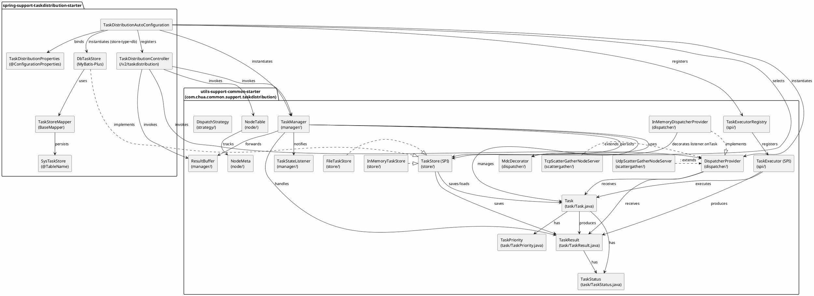
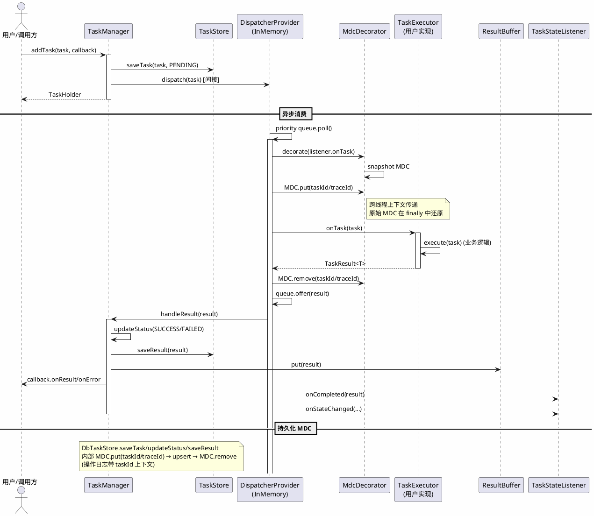
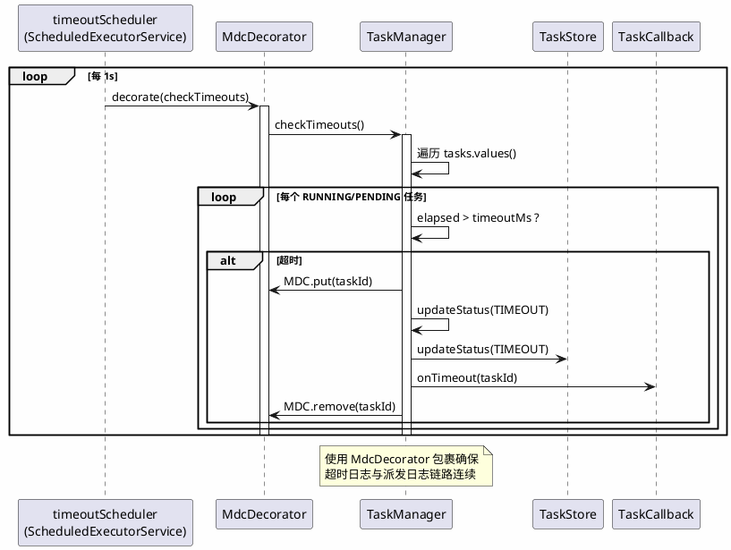
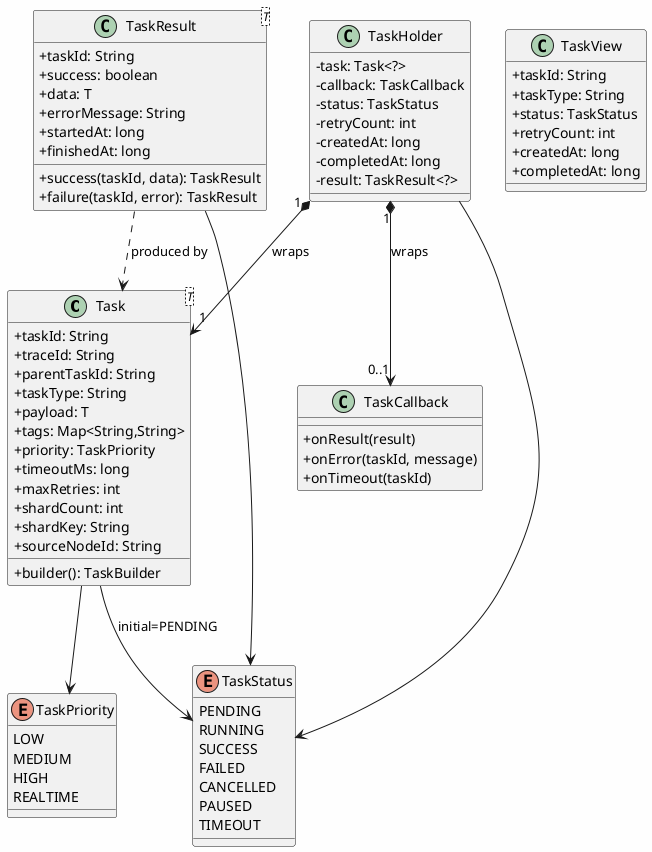
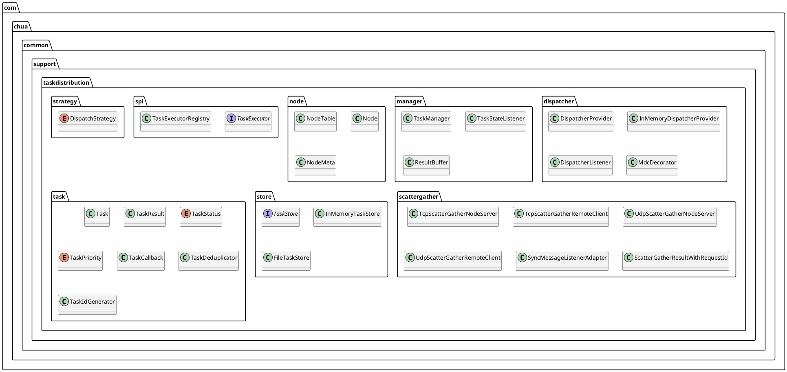
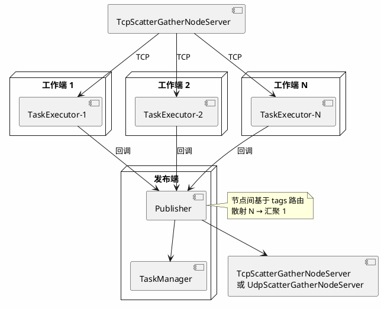

# Task Distribution Architecture

PlantUML 源文件。可通过 [PlantUML 在线渲染](https://www.plantuml.com/plantuml/uml/) 或 VS Code `plantuml` 扩展查看。

---

## 1. 模块依赖架构



---

## 2. 时序图：任务提交-派发-执行-结果



---

## 3. 时序图：超时检测



---

## 4. 类图：核心实体



---

## 5. 包结构



---

## 6. 集群模式：散射-汇聚



---

## 7. 数据流：DB 持久化模式

```plantuml
@startuml

skinparam backgroundColor #FEFEFE

database "MySQL / H2 / PostgreSQL" as DB

package "spring-support-taskdistribution-starter" {
    [DbTaskStore] --> [TaskStoreMapper]
    [TaskStoreMapper] --> [SysTaskStore]
}

package "MyBatis-Plus" {
    [TaskStoreMapper] --> DB : SQL
}

DB : sys_task_store\n- task_id PK\n- task_type\n- task_status\n- task_json\n- result_json\n- create_time\n- update_time

note bottom of DB
  task_json / result_json 使用
  Json.toJson(Task/TaskResult) 序列化
  反序列化用 Json.fromJson
end note

@enduml
```