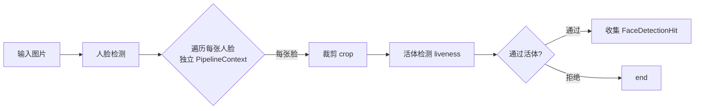
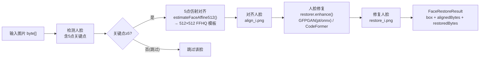
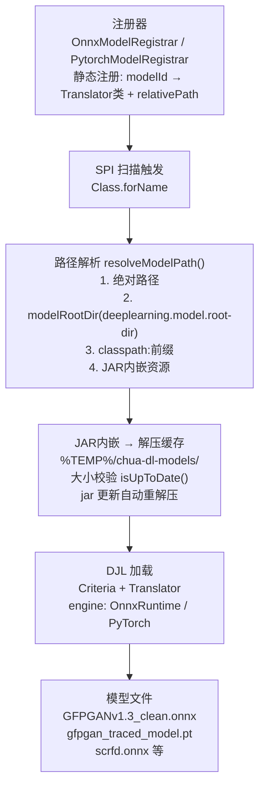

# 人脸识别全流程指南

> 模块：`utils-support-deeplearning-starter` · `com.chua.deeplearning.support.face`
> 说明：基于通用 Pipeline 框架编排的 FacePipeline 人脸识别能力，含检测、活体、对齐、修复、超分、特征、1:N 检索。

---

## 一、能力总览

| 能力 | 方法 | 默认模型 | 引擎 |
| --- | --- | --- | --- |
| 人脸检测 | `detect` / `detectBoxes` / `detectPipeline` | `scrfd-face-detector` / `retinaface` | ONNX |
| 活体检测 | `isLive` / `liveScore` | `face-liveness-flrgb` / `flxc` | ONNX |
| 人脸对齐 | `align` / `restoreWithAlign` | 5 点仿射（内置 OpenCV） | OpenCV |
| 人脸修复 | `restore` / `restoreWithAlign` | `onnx-gfpgan` / `pytorch-gfpgan` / `codeformer` | ONNX / PyTorch |
| 高清超分 | `superResolution` | `gfpgan-face-super-resolution` / `real-esrgan` | ONNX |
| 特征提取 | `extractFeature` | `r50-face-feature` / `arc-face` / `ada-face` | ONNX |
| 1:N 检索 | `identifyPipeline` | `VectorStorage`（内存/文件/Milvus） | 内置 |
| 1:1 比对 | `compareWithMeta` / `compareFeature` | 余弦相似度 | 内置 |
| 登记入库 | `enrollPipeline` / `enroll` | 复用完整特征管线 | 内置 |
| 属性分析 | `attributes` | `age-race-gender` | ONNX |
| 表情识别 | `emotion` | `emotion-ferplus` | ONNX |
| 关键点 | `landmark` | `2d106det` | ONNX |
| 质量评估 | `quality` | OpenCV Laplacian 方差 | OpenCV |
| 动漫检测 | `animeDetect` | `anime-face-detector` | ONNX |
| 换脸检测 | `isDeepfake` | `deepfake-detector` | ONNX |

---

## 二、核心流程

### 2.1 识别管线 `identifyPipeline`

```mermaid
flowchart LR
    IN["输入图片 byte[]"]
    DET["① 人脸检测 detectBoxes()<br/>SCRFD/RetinaFace/UltraFace"]
    BOX{"有检测框?"}
    CROP["② 裁剪 crop<br/>ImageCropUtils.crop 外扩 padding"]
    LIVE["③ 活体检测 liveness<br/>FLRGB/FLXC（外扩100%头部区域）"]
    LIVECHK{"通过活体?<br/>requireLive 可关闭"}
    ALIGN["④ 对齐 align<br/>5点仿射 → FFHQ 512×512"]
    RESTORE["⑤ 修复 restore<br/>GFPGAN / CodeFormer"]
    ENHANCE["⑥ 超分 enhance<br/>GFPGAN超分 / Real-ESRGAN"]
    FEAT["⑦ 特征提取 feature<br/>ArcFace / R50 / AdaFace 512维"]
    SEARCH{"配置向量库?"}
    SEARCHN["⑧ 1:N 检索 search<br/>VectorStorage.topK()"]
    RESULT["⑨ 收集 collectIdentify<br/>FaceIdentifyHit(box+feature+hits+live)"]

    IN --> DET --> BOX
    BOX -- "有" --> CROP --> LIVE --> LIVECHK -- "通过" --> ALIGN --> RESTORE --> ENHANCE --> FEAT --> SEARCH
    BOX -- "无" --> END1["end"]
    LIVECHK -- "拒绝" --> END1
    SEARCH -- "有向量库" --> SEARCHN --> RESULT
    SEARCH -- "无" --> RESULT
```



### 2.2 检测管线 `detectPipeline`（多人脸 + 活体过滤）



### 2.3 修复管线 `restoreWithAlign`



---

## 三、模型注册与加载链路



### 路径解析顺序（`ModelRegistry.resolveModelPath`）

1. `relativePath` 绝对路径（文件系统）
2. `{modelRootDir}/{relativePath}`
3. `classpath:` 前缀资源
4. 相对当前工作目录
5. classpath 多种前缀（`models/onnx/` 等）
6. JAR 内嵌资源 → 解压到缓存目录

> **缓存失效**：`extractClasspathResource` 增加 `isUpToDate()` 校验（比较 JAR 内资源与缓存文件大小），模型 jar 更新后自动重新解压，避免继续使用旧缓存模型。

---

## 四、向量库与相似度语义

### 4.1 相似度语义（v4.0.0.42 起统一）

- **`VectorCompareAlgorithm.compare(a, b)` 返回「相似度」，越大越相似**
- 完全相同的向量：
  - COSINE：`cos(θ) = 1.0`
  - EUCLIDEAN：`-0.0`
  - DOT：`‖a‖·‖b‖`
- 排序统一为**降序**（相似度最大的 topK 排最前）
- `FacePipeline.compareWithMeta` 使用余弦相似度 `[0,1]`，`score >= 0.5` 判定同一人

```java
// 内存向量库（512 维 + 余弦相似度）
VectorStorage storage = VectorStorageBuilder.newBuilder()
        .dimension(512)
        .algorithm("COSINE")
        .build();
```

### 4.2 登记 + 检索

```java
// 登记：最大人脸 → 完整特征管线 → 入库
pipeline.enrollPipeline("person-001", imageBytes, Map.of("name", "张三"));

// 识别 + 1:N 检索
List<FaceIdentifyHit> hits = pipeline.identifyPipeline(imageBytes);
FaceIdentifyHit h = hits.get(0);
String id = h.bestId();        // 最相似的人脸 ID
double score = h.bestScore();  // 余弦相似度，越大越相似
```

---

## 五、人脸修复（pt vs onnx）

### 5.1 背景

`FacePipeline.restoreWithAlign` 支持两种修复引擎：`pytorch-gfpgan` 与 `onnx-gfpgan`。
检测模型固定为 `scrfd-face-detector`，保证两侧对齐输入完全一致，仅修复模型不同。

### 5.2 对比测试结果

| 模型 | 与 pt float 差异 | 与 pt uint8 差异 | 偏色 | 单脸耗时 |
| --- | --- | --- | --- | --- |
| **旧 onnx**（含 RandomNormalLike） | 0.063 | ~8.0 | 明显偏绿/偏亮（1people2 G+14） | ~11s |
| **新 onnx**（harisreedhar/Face-Upscalers-ONNX） | **0.007** | **~0.9** | 无 | ~10s |
| **pt**（gfpgan_traced_model.pt） | 基准 | 基准 | 无 | ~60-90s |

**根因**：旧 onnx 模型含 15 个 `RandomNormalLike` 节点（每次推理注入随机噪声），且金字塔上采样浮点精度差异累积，导致输出偏亮偏灰、面部出现"长胡子/变老"类伪影。新模型为 PyTorch 2.0 干净导出（无 RandomNormalLike），输出与 pt 几乎一致。

**修复内容**：
1. 下载社区高质量 `GFPGANv1.3.onnx`（324.5MB），替换 `utils-support-models-onnx-gfpgan` 模块内模型并重新打包安装。
2. 修复 `ModelRegistry` 缓存失效 bug：jar 更新后旧缓存不再被复用。
3. 输出：`pt/restore_i.png` 与 `onnx/restore_i.png` 差异由 13.7 降至 1.04（0-255 尺度）。

### 5.3 测试方式

```text
FaceRestorePipelineCompareTest D:\images\1people2.png
→ 真实管线 restoreWithAlign + FacePipelineDiskCallback 回调落盘
→ 输出 D:\images\output\face_restore_compare\{图}\{pt|onnx}\
```

- **管线只负责各阶段回调落盘独立图片**，不拼接；对比图由外部脚本读落盘文件生成，仅用于展示。

---

## 六、完整测试（人脸识别 + 检索）

测试类：`FaceIdentifyFullTest`（`utils-support-example-starter`）
运行：`run_face_identify_full.ps1`

### 6.1 测试内容

1. **登记**：`3peoplebeauty.jpg`、`1people.png`、`1people2.png` 三图经 `enrollPipeline` 完整管线入库（检测→裁剪→活体→对齐→修复→超分→特征→入库）。
2. **识别**：同一批图经 `identifyPipeline`（检测→活体→对齐→修复→超分→特征→1:N 检索）。
3. **验证**：检索命中的 `bestId` 与登记的 ID 一致。

### 6.2 测试结果（2026-08-29）

```text
登记 1people2.png -> person-1p2-0 = true
登记 3peoplebeauty.jpg -> person-3pb-0 = true
登记 1people.png -> person-1p-0 = true
向量库 size=3
直接 search 1people: 3 条
  命中 id=person-1p-0 meta={score=1.0}      ← 自匹配相似度 1.0（排第一）
  命中 id=person-1p2-0 meta={score=0.31}
  命中 id=person-3pb-0 meta={score=0.19}
通过: 8, 失败: 0
```

### 6.3 测试中发现并修复的 Bug

| 问题 | 文件 | 修复 |
| --- | --- | --- |
| `BPlusTree.range(null, null)` 返回空，导致 `MemoryVectorStorage.allEntries()` 遍历不到数据、检索永远返回 0 条 | `BPlusTree.java` | `range` 支持 null 边界（null 视为 ±∞），`gte`/`lt` 辅助比较 |
| `VectorMath` 依赖 `jdk.incubator.vector`（JDK 21+ incubator），Corretto 25 无此模块导致 `NoClassDefFoundError` | `VectorMath.java` | 改为纯标量实现（点积/欧氏/余弦），任意 JDK 可编译运行 |
| `compare` 语义为"距离，越小越相似"，`bestScore` 易被误解 | `VectorCompareAlgorithm` / `MemoryVectorStorage` / `AbstractVectorStorage` | 统一为「相似度，越大越相似」，排序改降序 |

---

## 七、回调机制

管线各阶段通过 `FacePipelineCallback` 回调暴露中间结果，测试用 `FacePipelineDiskCallback` 落盘：

| 回调 | 触发时机 | 落盘文件 |
| --- | --- | --- |
| `onDetect` | 检测完成 | 仅日志（可覆写画框） |
| `onAlign(faceIndex, box, aligned)` | 每张人脸对齐完成 | `align_{i}.png` |
| `onRestore(faceIndex, restored)` | 每张人脸修复完成 | `restore_{i}.png` |

```java
FacePipeline pipeline = FacePipeline.builder()
        .detector("scrfd-face-detector")
        .feature("arc-face")
        .restore("onnx-gfpgan")
        .vectorStorage(storage)
        .build();
pipeline.setCallback(new FacePipelineDiskCallback(Path.of("D:/images/output/faces")));
pipeline.restoreWithAlign(imageBytes);
```
