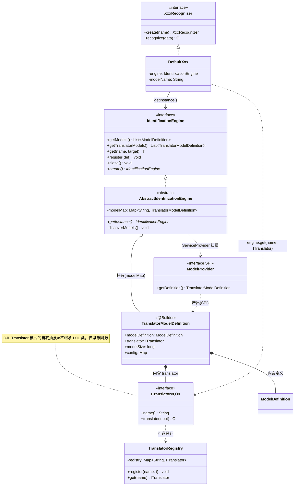
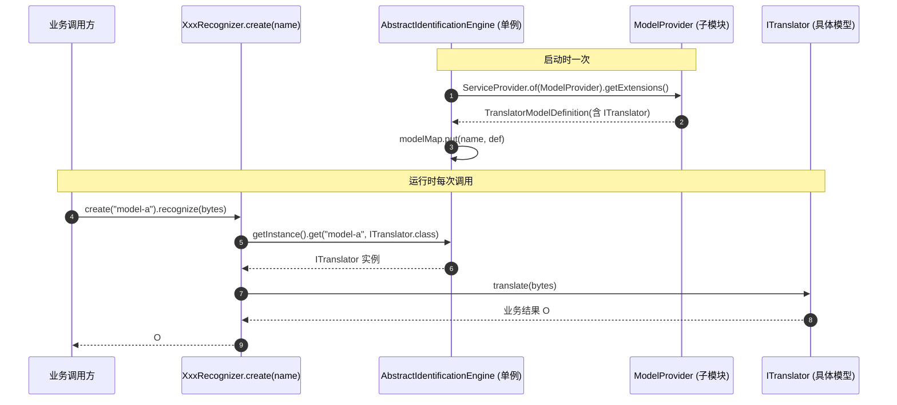

# 深度学习模块架构设计

> 模块坐标：`com.chua:utils-support-deeplearning-*`
> 设计目标：以 **`IdentificationEngine` 单例** 为中枢，统一管理所有 AI 模型（翻译器 `ITranslator` 与模型定义 `ModelDefinition`），
> 下游业务能力接口（OCR / 人脸 / 语音 / 姿态等）通过引擎按名称取用翻译器，实现 **模型实现与业务调用解耦**。

---

## 1. 模块总览与依赖关系图

### 1.1 Maven 聚合层级

```
utils-support-parent-starter (根聚合)
│
├── utils-support-core-parent (核心聚合)
│   ├── utils-support-common-starter          ← 通用 AI 接口底座
│   └── utils-support-deeplearning-starter    ← 深度学习核心抽象层 (本模块, 含 DJL 依赖)
│
└── utils-support-deeplearning-parent (深度学习聚合, 仅 packaging=pom)
    ├── utils-support-deeplearning-onnx-starter        ← 依赖 deeplearning-starter
    ├── utils-support-deeplearning-agentscope-starter ← 仅依赖 common-starter
    └── utils-support-deeplearning-langchain4j-starter ← 仅依赖 common-starter
```

> **关键点**：DJL（`ai.djl.onnxruntime:onnxruntime-engine`）依赖声明在 **核心模块 `deeplearning-starter`** 中，
> 而非聚合父模块 `deeplearning-parent`。`deeplearning-parent` 只是 pom 聚合壳，不携带任何代码/DJL 依赖；
> 真正的核心抽象下沉在 `core-parent/utils-support-deeplearning-starter`，因此子模块只能间接（通过 deeplearning-starter）得到 DJL。

### 1.2 模块依赖矩阵

| 模块 | artifactId | 父 | 关键依赖 |
|------|-----------|----|---------|
| 核心抽象 | utils-support-deeplearning-starter | core-parent | **common-starter, opencv 4.9.0-0, onnxruntime-engine(DJL) 0.36.0** |
| ONNX | utils-support-deeplearning-onnx-starter | deeplearning-parent | **deeplearning-starter**, onnxruntime 1.21.1, onnxruntime-engine 0.36.0 |
| AgentScope | utils-support-deeplearning-agentscope-starter | deeplearning-parent | common-starter, agentscope-harness 2.0.0-RC1 |
| LangChain4j | utils-support-deeplearning-langchain4j-starter | deeplearning-parent | common-starter, langchain4j-core 1.12.2, bge-small-zh 嵌入 |

> **重要**：`onnx-starter` 是**唯一**直接依赖 `deeplearning-starter` 的子模块；
> `agentscope` 与 `langchain4j` 直接对接 `common-starter` 的通用 AI 接口（Agent / ChatClient / EmbeddingClient），
> 不通过本模块的 `IdentificationEngine` 注册模型。

---

## 2. 核心抽象层架构

### 2.1 包结构

```
com.chua.deeplearning.support
├── config          # ModelSetting（modelPath / device）
├── embedding       # EmbeddingService（文本/图像向量嵌入）
├── engine          # 识别引擎（IdentificationEngine / AbstractIdentificationEngine / ModelProvider）
├── translator      # 翻译器模式（ITranslator / TranslatorModelDefinition / TranslatorRegistry）
├── model           # 预测结果模型（PredictResult / PredictRectangle / DetectionInfo）
├── face            # 人脸：FaceDetector / FaceFeature / FaceRecognizer
├── feature         # 特征：FeatureExtractor / FeatureSimilarity
├── image           # 图像：ImageClassifier / ImageDetector / ImageSegmenter
├── layout          # 版面：LayoutDetector
├── liveness        # 活体：LivenessDetector
├── ocr             # 文字：OcrRecognizer / OcrResult
├── plate           # 车牌：LicensePlateRecognizer
├── pose            # 姿态：PoseEstimator / PoseKeypoint
├── speech          # 语音：SpeechRecognizer / SpeechSynthesizer
```

### 2.1.1 类关系图（Mermaid）



### 2.1.2 运行时调用时序图（Mermaid）



### 2.2 核心接口

#### IdentificationEngine（识别引擎接口）
管理所有 AI 模型的生命周期与查找，是模型的**唯一持有者**。

```java
public interface IdentificationEngine {
    List<ModelDefinition> getModels();                       // 所有模型定义
    List<TranslatorModelDefinition> getTranslatorModels();   // 所有翻译器模型
    <T> T get(String name, Class<T> target);                 // 按名称 + 类型取实例
    <T> T get(Class<T> target);                              // 按类型取首个实例
    void register(TranslatorModelDefinition definition);     // 注册模型
    void close();                                            // 释放资源
}
```

#### AbstractIdentificationEngine（引擎抽象实现 + 单例）
- 构造时通过 `ServiceProvider.of(ModelProvider.class)` **扫描子模块所有 `ModelProvider` SPI**，
  将各自返回的 `TranslatorModelDefinition` 注册进内部 `modelMap`。
- 通过双重检查锁提供全局单例 `getInstance()`；优先取 SPI 注册的 `IdentificationEngine` 实现，
  无则回退到匿名实例。
- `get(name, target)` 实际从 `TranslatorModelDefinition.translator` 中按类型匹配返回。

#### ModelProvider（模型提供者 SPI）
各模型实现（ONNX / OpenCV 等）通过此接口向引擎贡献模型定义：

```java
@FunctionalInterface
public interface ModelProvider {
    TranslatorModelDefinition getDefinition();
}
```

#### ITranslator（翻译器）
**本质是 DJL `ai.djl.translator.Translator` 模式的「自我抽象」**。

DJL 的标准封装范式是 `Model` + `Translator<I,O>`（负责 preProcess / 推理 / postProcess）+ `Predictor`，
把「原始输入 → 张量 → 推理 → 业务输出」全套收进一个 Translator。本模块**不直接依赖 DJL 运行时 API**，
而是定义等价、更轻量的自有接口，使子模块既能沿用 Translator 思想，又可自由选择底层引擎
（ONNX 走原生 `ai.onnxruntime.OrtSession`，OpenCV 走 JavaCV，无需引入 DJL 的 `Predictor` 体系）。

```java
public interface ITranslator<I, O> {
    String name();      // 对应模型标识
    O translate(I input);   // = DJL Translator.process() 的等价：原始 I/O ↔ 业务对象
}
```

其作用：将模型原始输入/输出（如 `byte[]` 图像、`String` 文本）转换为业务对象
（`List<PredictRectangle>`、`String`、`float[]` 等），是 **模型实现与业务能力的解耦层**。

#### TranslatorModelDefinition（模型定义聚合）
封装一个可加载 AI 模型的完整信息：

```java
@Builder
public class TranslatorModelDefinition {
    ModelDefinition modelDefinition;   // 基础定义（名称/提供方/元数据）
    ITranslator<?, ?> translator;     // 翻译器实例（模型能力本体）
    long modelSize;                   // 模型文件大小
    Map<String, Object> config;        // 模型配置（含 path）
}
```

#### TranslatorRegistry（翻译器注册表）
按名称管理 `ITranslator` 实例的轻量注册表，供需要直接持有翻译器的场景使用。

---

## 3. 核心设计模式

### 3.1 引擎单例 + SPI 自动发现（模型托管中枢）

```
子模块（onnx-starter 等）
   └── 实现 ModelProvider（SPI: META-INF/services/...ModelProvider）
         └── getDefinition() 返回 TranslatorModelDefinition（含 ITranslator）

deeplearning-starter
   └── AbstractIdentificationEngine.getInstance()  [双重检查锁单例]
         └── 构造时 ServiceProvider.of(ModelProvider.class).getExtensions()
               └── 逐个 getDefinition() -> register() -> 存入 modelMap

业务能力接口（OcrRecognizer 等）
   └── AbstractIdentificationEngine.getInstance().get(name, ITranslator.class)
         └── translator.translate(input)  -> 业务结果
```

**一句话**：本模块负责**扫描子模块所有 `ITranslator` 与 `ModelDefinition` 并集中托管**，
业务能力调用方只依赖 `IdentificationEngine`，不感知任何具体模型实现。

### 3.2 翻译器模式（Translator Pattern）
- `ITranslator<I, O>` 隔离原始张量/字节流与业务对象之间的转换逻辑。
- 每个具体模型（ONNX 检测模型、OpenCV 分类模型等）对应一个 `ITranslator` 实现。
- 上层业务接口持有 `IdentificationEngine`，运行时按模型名取出 `ITranslator` 并调用 `translate`。

### 3.3 业务能力接口 + 默认实现（Facade）
所有业务能力以接口 + 包级 `DefaultXxx` 实现形式提供，统一通过 `create(name)` 静态工厂构造，
内部自动绑定 `AbstractIdentificationEngine.getInstance()`，对调用方隐藏引擎细节。

```java
OcrRecognizer.create("paddle-ocr").recognize(imageBytes);
FaceDetector.create("yolov8-face").detect(imageBytes);
EmbeddingService.create("bge-zh").embed("文本");
```

---

## 4. 业务能力矩阵

| 能力域 | 业务接口 | 典型 ITranslator 签名 |
|--------|---------|----------------------|
| OCR | OcrRecognizer / OcrResult | `ITranslator<byte[], String>` / `List<OcrResult>` |
| 人脸 | FaceDetector / FaceFeature / FaceRecognizer | `ITranslator<byte[], List<PredictRectangle>>` / `float[]` |
| 图像 | ImageClassifier / ImageDetector / ImageSegmenter | `ITranslator<byte[], String>` / `List<DetectionInfo>>` / `byte[]` |
| 语音 | SpeechRecognizer / SpeechSynthesizer | `ITranslator<byte[], String>` / `String, byte[]` |
| 姿态 | PoseEstimator / PoseKeypoint | `ITranslator<byte[], List<PoseKeypoint>>` |
| 车牌 | LicensePlateRecognizer | `ITranslator<byte[], String>` / `List<DetectionInfo>` |
| 版面 | LayoutDetector | `ITranslator<byte[], Map<String, List<PredictRectangle>>>` |
| 活体 | LivenessDetector | `ITranslator<byte[], Boolean>` / `Float` |
| 特征 | FeatureExtractor / FeatureSimilarity | `ITranslator<byte[]/String, float[]>` |
| 嵌入 | EmbeddingService | `ITranslator<String/byte[], float[]>` |

---

## 5. 子模块实现说明（非 via IdentificationEngine 的部分）

除「翻译器托管」主线外，子模块还通过 `common-starter` 的通用 AI 接口对外提供能力：

| 子模块 | SPI 注册文件 | 注册目标接口 | 实现类 |
|--------|-------------|-------------|--------|
| onnx-starter | `META-INF/extensions/com.chua.common.support.ai.chat.ChatClient` | ChatClient | MiniMindChatClient（`@Spi("minimind")`） |
| agentscope-starter | `META-INF/extensions/com.chua.common...ai.agent.Agent` | Agent | AgentScopeAgent |
| langchain4j-starter | `META-INF/extensions/com.chua.common.ai.embedding.EmbeddingClient` | EmbeddingClient | （LangChain4j 嵌入实现） |
| langchain4j-starter | `META-INF/extensions/com.chua.common.TextSplitter` | TextSplitter | （LangChain4j 分块实现） |

> 这些 SPI 走的是 `common-starter` 的扩展体系，与 `deeplearning-starter` 的 `ModelProvider` 体系并行存在。

### ONNX 推理内部结构（onnx-starter）
```
MiniMindChatClient (@Spi ChatClient)
   ├── MiniMindTokenizer    (GPT-2 BPE，纯 Java 实现)
   └── MiniMindModel        (ONNX Runtime 封装，prefill/decode/KV-cache)
         └── OnnxSessions   (SessionOptions 工具：CPU/CUDA/LLM 优化)
```

---

## 6. 扩展指南

### 6.1 新增一个「翻译器模型」（接入 IdentificationEngine 托管）
1. 在 `deeplearning-starter` 定义业务接口（如 `XxxRecognizer`）+ 包级 `DefaultXxx`。
2. 在 `onnx-starter`（或新子模块）实现 `ITranslator<byte[], XxxResult>`。
3. 实现 `ModelProvider`（返回 `TranslatorModelDefinition`），在
   `META-INF/services/com.chua.deeplearning.support.engine.ModelProvider` 注册。
4. 调用方：
   ```java
   XxxRecognizer.create("my-model").recognize(imageBytes);
   ```

### 6.2 新增一个「通用 AI 能力」（走 common-starter SPI）
1. 实现 `ChatClient` / `Agent` / `EmbeddingClient` 等 `common-starter` 接口。
2. 在 `META-INF/extensions/<接口全限定名>` 注册实现类。
3. 通过 `ChatClient.create("spi-name", ...)` 等方式取用。

### 6.3 新增一个模型引擎子模块
1. 新建 `utils-support-deeplearning-xxx-starter`，父模块改为 `deeplearning-parent`。
2. 依赖 `utils-support-deeplearning-starter`。
3. 通过 `ModelProvider`（翻译器托管）或 `common-starter` SPI（通用能力）二选一/并存接入。
4. 在 `deeplearning-parent/pom.xml` 的 `<modules>` 中声明。

---

## 7. OCR 管线（OcrPipeline）

OCR 组合业务基于通用 `Pipeline` 框架编排，参考 `FacePipeline` 模式（非手写循环）。

### 7.1 管线流程

```
整图方向矫正(correct)
  → 检测(det, paddleocrv6-medium-det)
  → 裁剪(每个文本块, padding 2px)
  → 裁剪块方向矫正(0°/180°, pp-word-rotate)
  → 修复可选(text-bsr 2x 高清化)
  → 识别(rec, paddleocrv6-medium-rec)
  → 置信度过滤(minConfidence 0.6)
```

- **整图矫正**：横向图判 0/180°；纵向图（高>1.2宽）旋转90°后判方向；正方形不旋转
- **裁剪块矫正**：每个文字块独立判方向，支持同图混合正/斜文字
- **深背景自动反色**：平均亮度 <128 时反色为白底黑字（提升识别率）
- **置信度过滤**：过滤背景防伪/噪声文字（如车票 "CR" 水印）

### 7.2 使用示例

```java
OcrPipeline pipeline = OcrPipeline.builder()
        .detector("paddleocrv6-medium-det")
        .recognizer("paddleocrv6-medium-rec")
        .direction("pp-word-rotate")       // 方向矫正
        .enhancer("text-bsr")              // 文字高清化（可选）
        .minConfidence(0.6f)               // 置信度过滤
        .build();

String text = pipeline.recognize(imageBytes);              // 拼接文本
List<OcrResult> results = pipeline.recognizeDetail(imageBytes); // 详情
OcrPipeline.OcrRecognizeResult d = pipeline.recognizeDetailWithImage(imageBytes); // 图+结果（标注）
byte[] corrected = pipeline.correct(imageBytes);           // 单独整图矫正
byte[] enhanced = pipeline.enhance(imageBytes);            // 单独高清化
```

### 7.3 关键类

| 类 | 说明 |
|----|------|
| `OcrPipeline` | OCR 统一门面（onnx-starter `com.chua.deeplearning.support.onnx.ocr`），检测+矫正+识别+修复编排 |
| `PpOcrDetTranslator` / `PpOcrDetMediumTranslator` | PP-OCRv6 文字检测（DB，ORT 原生），tiny/medium 版 |
| `PpWordExtractorTranslator` / `PpWordExtractorMediumTranslator` | PP-OCRv6 文字识别（CTC，ORT 原生），dict 从 inference.yml 提取 |
| `PpWordRotateTranslator` | PP-OCR 文本方向分类（0°/180°） |
| `TextBsrTranslator` | 文字超分（TextBSR RRDBNet，默认 2x） |
| `OpenCvImageUtils` | OpenCV 图像操作统一工具（decode/encode/upscale/rotate/invertIfDark/load），各 translator 统一调用 |

### 7.4 OpenCV 统一工具类

`OpenCvImageUtils`（onnx-starter `com.chua.deeplearning.support.onnx.utils`）统一封装 OpenCV 操作，
各 translator 不再散落 `nu.pattern.OpenCV.loadLocally()` 与图像处理代码：

| 方法 | 说明 |
|------|------|
| `load()` | 幂等加载 OpenCV（进程内一次） |
| `decode(byte[])` / `encode(Mat)` | 图像编解码 |
| `upscale(byte[], scale)` | 放大（双线性插值） |
| `rotate(byte[], degree)` | 90/180/270 旋转 |
| `invertIfDark(byte[])` | 深背景反色（白底黑字） |
| `isDarkBackground(byte[])` | 亮度判断 |

> DJL 0.36 下 `onnxruntime-engine` 不支持 NDArray 张量运算（resize/sub/div 等），
> 所有图像预处理统一走 OpenCV（经 `OpenCvImageUtils`），再 `create(float[], shape)` 喂入模型。

---

## 8. 人脸管线（FacePipeline）

人脸组合业务基于通用 `Pipeline` 框架编排（参考 OCR 管线同款模式），每张人脸一个独立 `PipelineContext`，外层循环驱动。

### 8.1 检测管线（detectPipeline）

```
整图 → 检测(detector) → 裁剪(ImageCropUtils.crop)
  → 活体检测(liveness) → 过滤非活体(可选, requireLive) → 收集 FaceDetectionHit
```

### 8.2 识别管线（identifyPipeline）

```
整图 → 检测(detector.detect) 获取所有人脸框
  → 外层循环：每张人脸一个独立 PipelineContext
  → 裁剪(裁出人脸图)
  → 活体检测(liveness，可选，requireLive=true 时过滤假体)
  → 对齐(alignFace：基于关键点摆正，旋转到左右眼水平，提升后续精度)
  → 修复(restore：对齐之后，如 codeformer 修复遮挡/模糊/老化)
  → 高清化(superResolution：修复之后，超分提升分辨率)
  → 特征提取(featureExtractor.extract，用高清化后人脸)
  → 向量检索(vectorStorage.search Top-K)
  → 收集 FaceIdentifyHit(检测框 + 特征 + 命中 + 活体状态)
```

### 8.3 节点决策链

```
crop → hasFace? → liveness → isLive? → align → hasAligned? → restore → hasRestored? → enhance → feature → hasFeature? → search
                ↘ end          ↘ end                          ↘ end                ↘ end                ↘ collectIdentify(无库/无特征)
```

> 对齐/修复/高清化节点未配置对应模型时跳过（`null` 直接透传），特征提取用高清化→修复→对齐→原图逐级兜底。

### 8.4 使用示例

```java
FacePipeline pipeline = FacePipeline.builder()
        .detector("scrfd-face-detector")
        .feature("r50-face-feature")
        .liveness("face-anti-spoof")
        .landmark("faceplugin-face-landmark")      // 对齐
        .restore("codeformer")                     // 修复
        .superResolution("gfpgan-face-super-resolution") // 高清化
        .vectorStorage(vectorStorage)
        .requireLive(true)
        .build();

List<FaceDetectionHit> detections = pipeline.detectPipeline(imageBytes);
List<FaceIdentifyHit> identifications = pipeline.identifyPipeline(imageBytes);
boolean ok = pipeline.enrollPipeline("uid-1", imageBytes, metadata); // 登记
```

### 8.5 能力方法

| 方法 | 说明 |
|------|------|
| `detectPipeline` / `identifyPipeline` / `identifyPipelineLargest` | 检测 / 识别 / 最大人脸识别管线 |
| `enrollPipeline` | 登记：最大人脸 → 特征 → 入库 |
| `detect` / `detectLargest` / `detectBoxes` | 单独检测能力 |
| `extractFeature` / `compareFeature` / `search` / `enroll` | 特征提取 / 1:1 比对 / 检索 / 入库 |
| `animeDetect` | 动漫人脸检测（辅助能力） |
| `superResolution` / `restore` | 高清化 / 修复（辅助能力） |
| `attributes` / `emotion` / `landmark` / `quality` / `isDeepfake` | 属性 / 表情 / 关键点 / 质量 / 换脸检测 |
