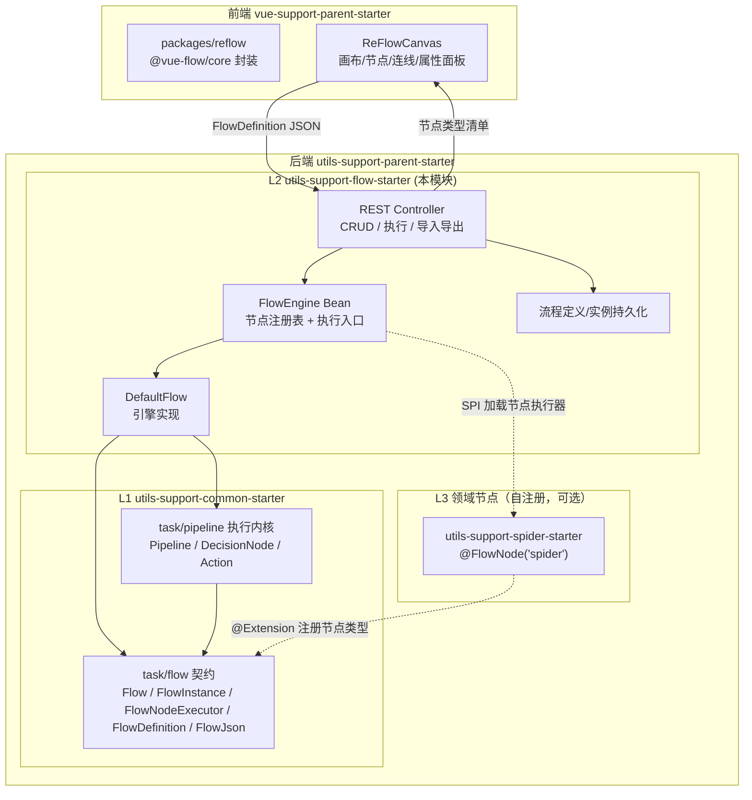
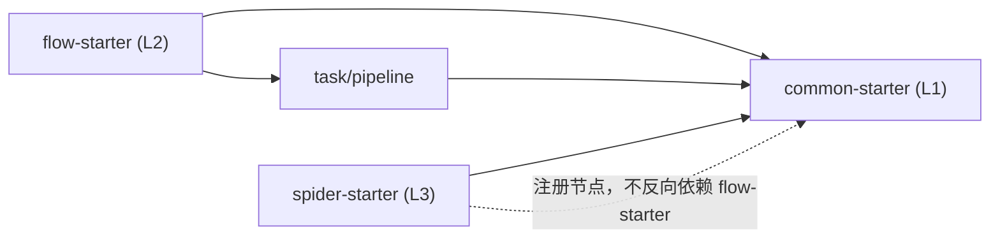
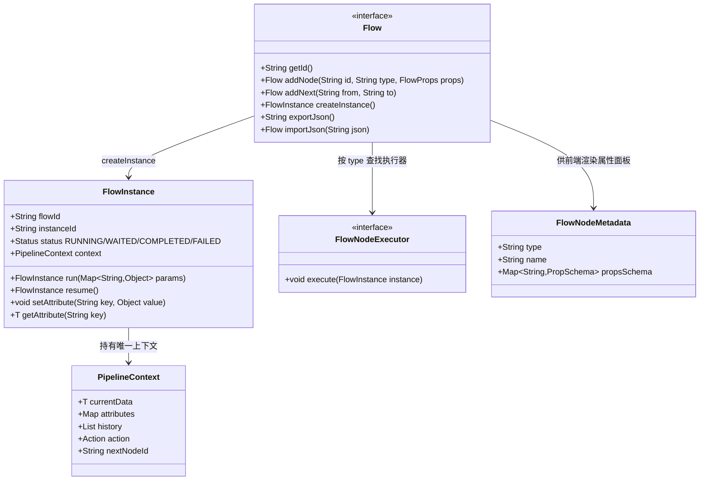
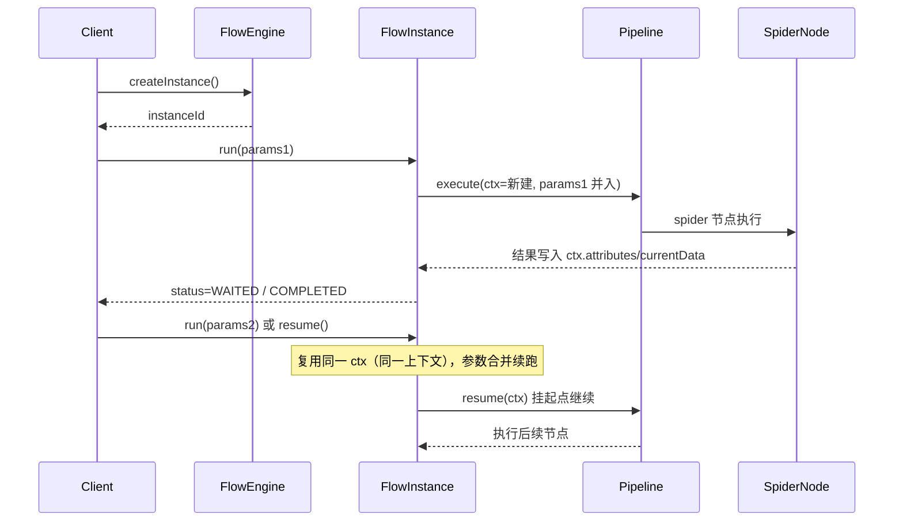
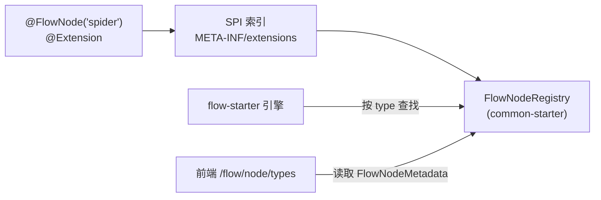
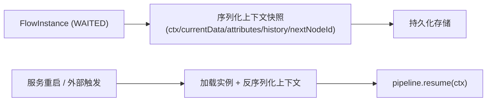
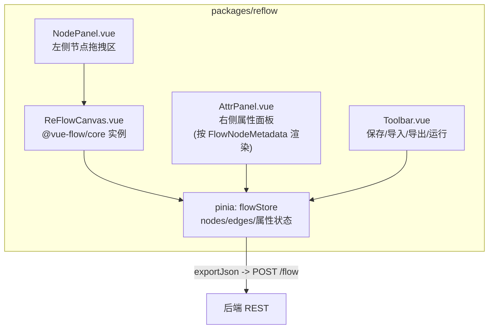
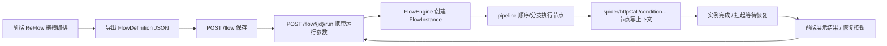

# 流程编排（Flow）架构图

> 本文档描述 `utils-support-flow-starter` 及其上层契约、领域节点、前端 ReFlow 的整体架构，涵盖模块分层、依赖关系、核心对象模型、执行时序与数据格式。

## 1. 总体架构

端到端打通「前端可视化编排 → 后端执行引擎 → 领域节点执行」，前后端以统一图格式（`FlowDefinition` JSON）为交换契约。



## 2. 模块分层与依赖关系

| 层级 | 模块 | 职责 | 依赖 |
|------|------|------|------|
| L1 | `utils-support-common-starter` | `task/flow` 契约（接口/模型/节点注册 SPI）+ `task/pipeline` 执行内核 | 无外部 |
| L2 | `utils-support-flow-starter` | 引擎实现、Spring Boot 自动装配、持久化、REST | common-starter |
| L3 | `utils-support-spider-starter` | 领域节点实现（`spider`） | 仅 common-starter |

**依赖原则（无循环）**：



- 领域节点只依赖 L1 契约，**不反向依赖 flow-starter** → 任意领域模块注册节点均不破坏核心
- flow-starter 通过 SPI 发现已注册的 `@FlowNode` 执行器，运行时按节点 `type` 查找

## 3. 核心对象模型



**关键设计**：`Flow`（定义，不可变、可序列化）与 `FlowInstance`（一次运行，可变、可持久化）分离；`FlowInstance` 内部**唯一持有** `PipelineContext`，是"运行必定同一个上下文"的载体。

## 4. 执行引擎桥接

`DefaultFlow` 将 `FlowDefinition` 图桥接到现有 `task/pipeline` 执行内核：

```mermaid
graph LR
    subgraph FlowDefinition
        N1["node: start"]
        N2["node: condition"]
        N3["node: httpCall"]
        E1["edge start->condition"]
        E2["edge condition->httpCall label=true"]
        E3["edge condition->end label=false"]
    end

    subgraph Pipeline
        T1["StartNode"]
        D1["DecisionNode"]
        T2["TaskNode"]
    end

    N1 --> T1
    N2 --> D1
    N3 --> T2
    E1 --> "nextNodeId 顺序推断"
    E2 --> D1.branches[true]
    E3 --> D1.branches[false]
```

- 顺序边 → pipeline 有序节点默认 next
- `condition` 节点 → `DecisionNode`（`when(true,..)/when(false,..)`）
- `TaskNode` 执行体 = 从节点注册表按 `type` 取出的 `FlowNodeExecutor`
- 挂起/恢复 → 引擎 `Action.WAIT` / `Pipeline#resume(ctx)`

## 5. 执行时序（同一上下文）



**要点**：
- 每次 `run(params)` 参数合并进 `ctx.attributes`，`currentData` 可更新
- 上下文只随实例销毁，**跨多次运行不重建**
- 同一实例并发 `run` 由状态机 + 锁拦截，避免上下文竞态

## 6. 节点类型注册机制



注册流程：
1. 领域模块实现 `FlowNodeExecutor`，标注 `@FlowNode(type)`
2. 编译期生成 SPI 索引（复用 common-starter 的 `@Extension` 机制）
3. 运行时 `FlowNodeRegistry` 汇总全部类型 → 引擎按 `type` 实例化执行器，前端拉取类型元信息渲染属性面板

## 7. 统一图格式（FlowDefinition）

```json
{
  "id": "flow1",
  "name": "审批流程",
  "nodes": [
    { "id": "start", "type": "start",  "props": {},                   "x": 100, "y": 100 },
    { "id": "check", "type": "condition", "props": {},                "x": 300, "y": 100 },
    { "id": "end",   "type": "end",    "props": {},                   "x": 500, "y": 100 }
  ],
  "edges": [
    { "from": "start", "to": "check", "label": "" },
    { "from": "check", "to": "end",   "label": "true" }
  ]
}
```

- **导出**：`FlowDefinition` → JSON（拓扑 + 节点类型/参数 + 画布坐标）
- **导入**：JSON → 注册表查类型 → 实例化执行器 → 构建 pipeline
- `x/y` 仅供前端画布使用，后端忽略；`label` 为分支标签

## 8. 断点续跑



- 挂起实例的上下文整体持久化，保证恢复后仍是同一上下文
- 异步长任务（如爬虫后台抓取）完成回调后触发 `resume`

## 9. 前端 ReFlow 架构



- 画布操作实时反映到 `flowStore`，序列化为 `FlowDefinition` 提交后端
- 导入后端 JSON 时按 `FlowNodeMetadata` 还原节点属性表单
- 节点类型列表来自 `/flow/node/types`

## 10. 端到端流程


