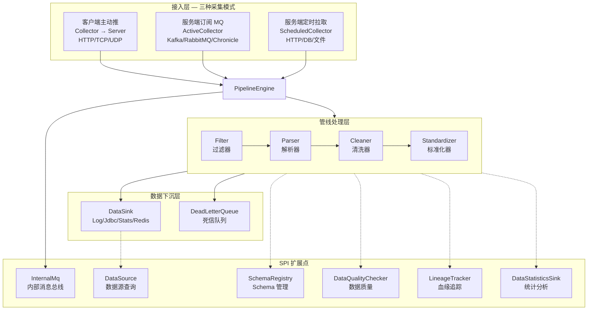
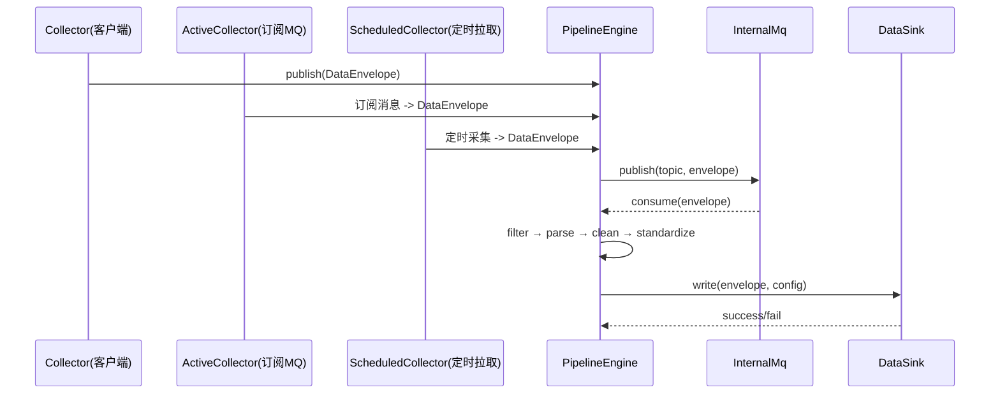

# Utils Support Datalake Parent

数据中台父模块，提供数据采集、订阅、分析、查询等数据湖/数据中台相关功能。

> 最后构建: 2026-07-17
> Java 25 + Maven 3.9

---

## 系统架构



## 三种采集模式

| 模式 | SPI | 方向 | 用途 | 实现 |
|---|---|---|---|---|
| **客户端主动推** | `Collector` → `CollectorServer` | 客户端 → 服务端 | HTTP/TCP 客户端上报 | `DatalakeHttpCollector` |
| **服务端订阅 MQ** | `ActiveCollector` | 服务端 → MQ | 监听消息队列 | `KafkaActiveCollector` |
| **服务端定时拉取** 🆕 | `ScheduledCollector` | 服务端 → 外部源 | cron 定时轮询 | `WeatherScheduledCollector` |

## 模块结构

```
utils-support-datalake-parent (L1 parent)
├── datalake-sink-api-starter       ← SPI 接口 + 模型层
├── datalake-starter                 ← 核心引擎 + 管线 + Server
├── datalake-collector-starter       ← 采集器客户端
├── datalake-subscribe-starter       ← 订阅器客户端 SPI
├── datalake-analysis-starter        ← 统计分析 Sink
├── datalake-query-starter           ← 引擎查询
├── calcite-starter                  ← Calcite SQL 引擎
└── logicflow-starter                ← LogicFlow 图引擎
```

## 数据流



## 模块说明

| 模块 | 源文件 | 说明 |
|---|---|---|
| **datalake-sink-api-starter** | 30 | SPI 接口 + 模型层（含 ScheduledCollector 🆕） |
| **datalake-starter** | 92 | 核心引擎、管线管理、Sink 实现、Server、Transport |
| **datalake-collector-starter** | 10 | 采集器客户端 |
| **datalake-subscribe-starter** | 2 | 订阅器客户端 SPI |
| **datalake-analysis-starter** | 4 | 统计分析 Sink |
| **datalake-query-starter** | 0 | 引擎查询 |
| **calcite-starter** | 0 | Calcite SQL 引擎 |
| **logicflow-starter** | 0 | LogicFlow 图引擎 |

## 关键 SPI 接口

### InternalMq — 内部消息队列
```
com.chua.datalake.support.spi.transport.InternalMq
  ├── publish(topic, envelope)   发布消息
  ├── subscribe(topic, consumer) 订阅消息
  └── start() / stop()           生命周期
```

### DataSink — 数据下沉
```
com.chua.datalake.support.spi.storage.DataSink
  ├── type()                     "log"/"realtime"/"stats"/"redis"
  ├── write(envelope, config)    写入数据
  ├── getDataSource()            关联 DataSource
  └── schemaMode()               模式 REQUIRED/OPTIONAL/NOT_SUPPORTED
```

### ScheduledCollector — 定时采集器 🆕
```
com.chua.datalake.support.spi.collection.ScheduledCollector
  ├── name()                     采集器名称
  ├── cron()                     cron 表达式
  ├── start() / stop()           生命周期
  ├── collect()                  执行一次采集
  ├── setHandler(Consumer)       注册数据处理器
  └── isRunning()                运行状态
```

## 外部集成

| 中间件 | 模块 | SPI 实现 |
|---|---|---|
| MQTT | `middleware/mqtt-starter` | `MqttSubscriber` |
| Redis | `middleware/redis-starter` | `RedisDataSink` |
| Kafka | `middleware/kafka-starter` | `KafkaDispatcherProvider` |
| Chronicle | `middleware/chronicle-starter` | `ChronicleActiveCollector` 🆕 |
| RabbitMQ | `middleware/rabbitmq-starter` | `RabbitmqDispatcherProvider` |
| Sync | `datatask/sync-starter` | `SyncDataPipeline` |
| Excel | `filesystem/excel-starter` | `ExcelSyncDataSource` |
| Word | `filesystem/word-starter` | `WordSyncDataSource` |
| DBF | `filesystem/dbf-starter` | `DbfSyncDataSource` |
| PDF | `filesystem/pdf-starter` | `PdfSyncDataSource` |

## 示例项目

| 示例 | 模块 | 说明 |
|---|---|---|
| `DatalakeFullExample` | `core/example-starter` | 定时采集 → Sink 写入全流程 |
| `SyncExample` | `extra/example-starter` | 数据同步引擎使用示例 |
